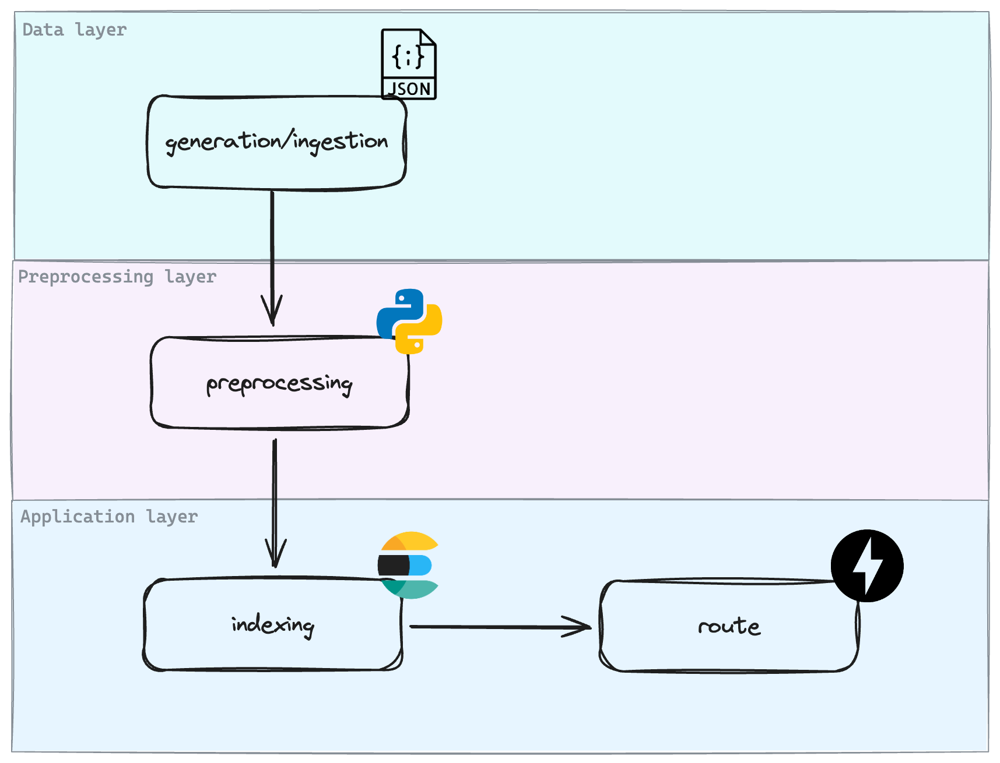

# rankdaora

`rankdaora` is a lightweight ranking system prototype built on top of Elasticsearch and FastAPI.
It demonstrates how to enrich search results by combining traditional relevance scores with additional signals — such as user interaction — to produce more “daora” (cool and optimal) rankings.

The project is designed to be simple, modular, and easily extensible, serving as a foundation for experimenting with new ranking strategies, hybrid scoring models, and signal integration.

<p align="center" style="margin: 3em">
  <a href="rankdaora-architecture.png">
    
  </a>
</p>

## Overview

- `compose.yaml` orchestrates Elasticsearch and the FastAPI API service.
- `scripts/generate_dataset.py` produces a synthetic dataset (~120 documents).
- `scripts/load_documents.py` recreates the `legal-docs` index and bulk inserts the documents.
- `src/app` contains the FastAPI application, Pydantic models, and Elasticsearch client integration.
- `preprocessing/` hosts click-signal preparation helpers (time decay, IPS, Bayesian smoothing, log scaling).
- `tests/` provides pytest suites that use a fake client to simulate the backend.
- `.github/workflows/ci.yml` runs linting (`ruff`) and tests on pull requests and pushes.

## Requirements

- Docker and Docker Compose
- Python 3.11+ (optional, for running utility scripts outside the container)

## Running with Docker Compose

1. Generate the synthetic dataset (only once or whenever you want to refresh the data):

   ```bash
   poetry run python scripts/generate_dataset.py
   ```

2. Load the documents into Elasticsearch (run after the service is ready):

   ```bash
   docker-compose up -d elasticsearch
   poetry run python scripts/load_documents.py --recreate-index
   ```

3. Bring up the API with auto-reload:

   ```bash
   docker-compose up --build api
   ```

   The API will be available at `http://localhost:8000`. The `/search?query=...` route returns ordering based on Elasticsearch relevance.

## Running tests and lint

```bash
poetry run make install
poetry run make pre-commit
```